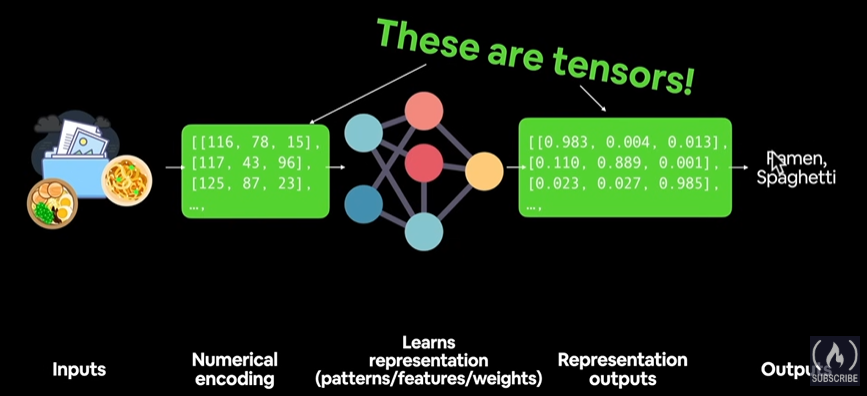

# Deep Learning
<b>Machine Learning:</b> Turning things (data) into numbers and finding patterns in those numbers

- DL --> ML --> AL

 

Rule 1 of Google's Machine Learning Handbook:
> "If you can build a <b>simple rule-based</b> system that doesn't require machine learning, do that."

#### What deep learning is good for?
- Tasks with too many rules for humans to write: Deep learning handles complex patterns where manual rules break down. Example: Speech recognition, image classification.

- Environments that change over time: Deep learning models can keep learning and adapt as new data comes in.

- Finding patterns in huge datasets: When data is large and messy (like millions of images or texts), deep learning can uncover relationships that humans would miss.

#### What DL is not good for? (typically)
- When you need clear explanations: Deep learning models act like “black boxes.” You can’t easily see why they make a decision.

- When simple methods work better: If a rule-based or basic machine learning approach solves your problem, deep learning may be overkill.

- When mistakes are not allowed: Deep learning models can be unpredictable. If errors are critical (like in medical diagnosis or safety systems), avoid them.

- When you have limited data: Deep learning needs a lot of training data. With small datasets, 
results are usually poor.

 

#### ML vs DL
- ML for structured (tabular) data
- DL for unstructured data
- ML: random forest, gradient boosted models, naive bayes, nearest neighbor, support vector machine, etc.
- DL: neural networks, fully connected neural network, convolutional neural network, recurrent neural network, transformer, etc.

#### What is tensors?
